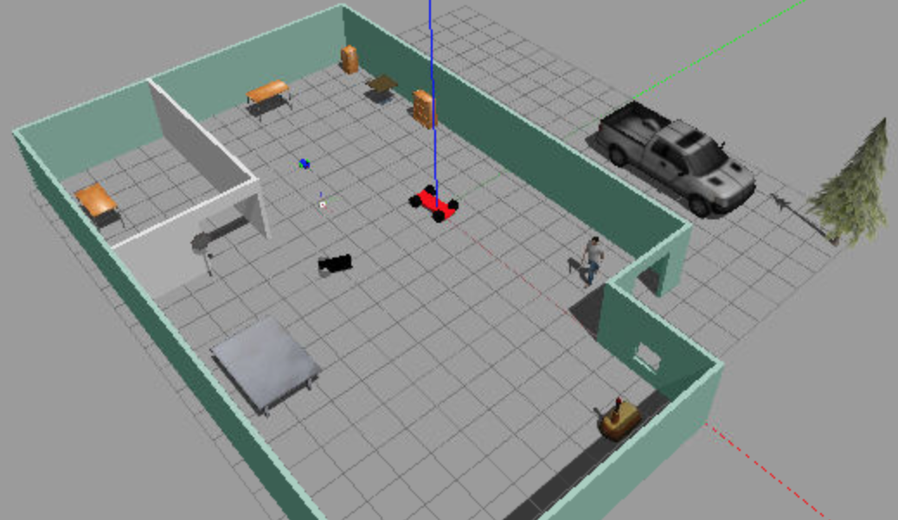
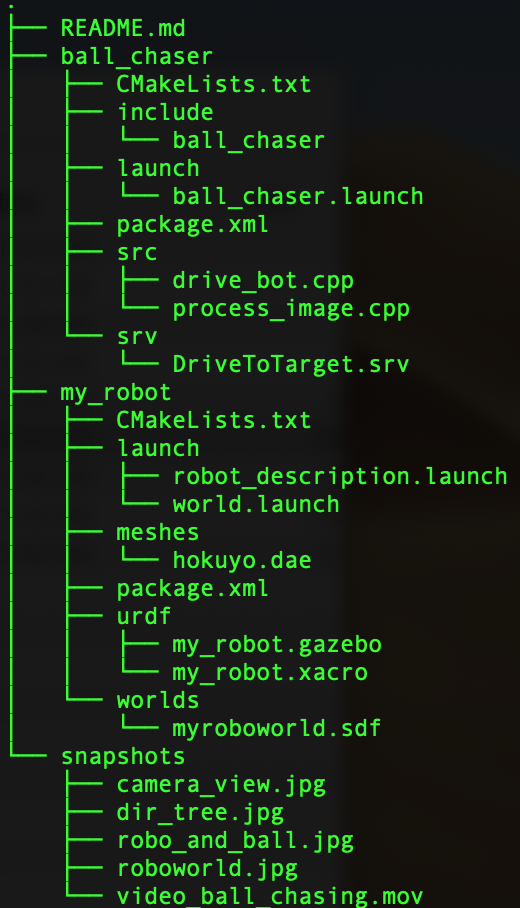
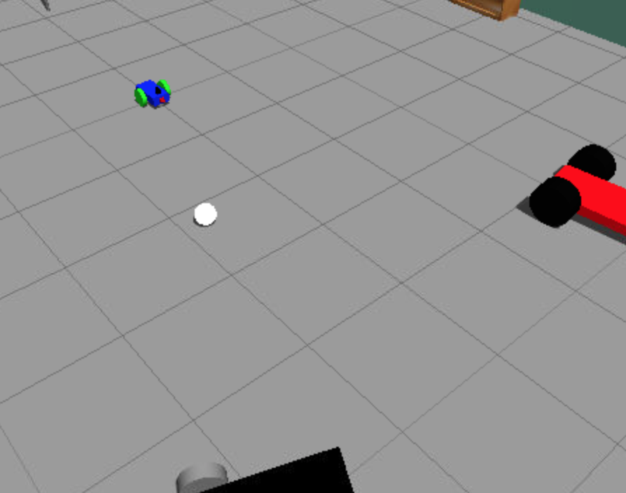
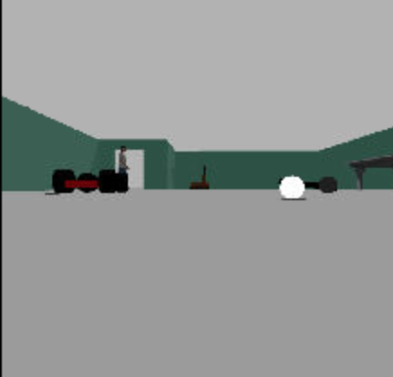

# Ball chasing Robot (ROS)

Project-2 of Udacity's Robotics Software Engineer Nanodegree Program




**Project Goals**

In this project, the goal is to design a robot that will chase a white-ball, when it falls within it's forward facing camera's view. The project covers following topics:

* Design of robot and it's surroundings using Gazebo and Gazebo plugins
* using URDF (Unified Robot Description Format)
* ROS nodes, publishers, subscribers, services
* RViz
* C++


### Prerequisites
(since I have not tested on multiple platforms, and versions, I am listing only the configuration I used)

* Ubuntu 16.04 OS with default make (>=4.1) and g++/gcc (>=5.4) packages
* Gazebo >= 7.0
* ROS Kinetic

### Directory Tree and contents

This directory represents the main project's `src` folder. Within this folder, project is divided into two sub-folders, with notable entities listed below:

* **`my_robot`** - my_robot package
	* `launch` - folder for launch files
	* `meshes` - meshes folder for sensors
	* `urdf` - folder for xacro files
	* `worlds` - folder for gazebo world files
	* `CMakeLists.txt` - compiler instructions
	* `package.xml` - package info
* **`ball_chaser`** - ball chaser package
	* `launch` - folder for launch files
	* `src` - C++ scripts' source folder
	* `srv` - folder for ROS services
	* `CMakeLists.txt` - compiler instructions
	* `package.xml` - package info
* **snapshots**: folder with images/videos used for this *README.md* file

---

---

### Clone and Build

Since the set of foles presented here comprise only of ROS packages, one needs to first create a catkin workspace and initialize it. Within your `home` directory, execute the following:

```
$ mkdir -p catkin_ws/src
$ cd catkin_ws/src
$ catkin_init_workspace
```

Within `~/catkin_ws/src/` download or clone folders of this repository:

```
$ cd ~/catkin_ws/src/
$ git clone https://github.com/viks8dm/Go-Chase-It.git/my_robot my_robot
$ git clone https://github.com/viks8dm/Go-Chase-It.git/ball_chaser ball_chaser
```

Go back to catkin workspace and build it

```
$ cd ~/catkin_ws/
$ catkin_make
```

### Launch and Chase

Source and launch robot:

```
$ source devel/setup.bash
$ roslaunch my_robot world.launch
```

This will launch RViz and Gazebo, showing a world similar to that in image at top. If you zoom in you will see the blue robot with white-ball placed a little away from it, as shown below.

---

---

Use RViz to check if ball is within robot's camera's frame. On the left side of RViz, under Displays:

* Select `odom` for **fixed frame**
* Click the **Add** button and add `Camera` and select the Image topic `rgb/image_raw`. If the ball is out of sight of robot's camera, place it in view and camera display of RViz should show something similar to the following image.

---

---

launch the `ball_chaser` in a separate terminal

```
$ cd ~/catkin_ws/
$ source devel/setup.bash
$ roslaunch ball_chaser ball_chaser.launch
```

This will launch ball-chaser node that processes the camera image looking for white ball. Whenever white ball is in sight, robot is commanded to move towards it. A demo can be seen in the video below

<video width="320" height="240" controls>
  <source src="./snapshots/video_ball_chasing.mov" type="video/mp4">
</video>
